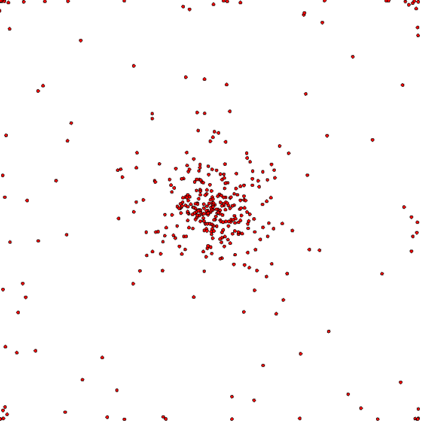
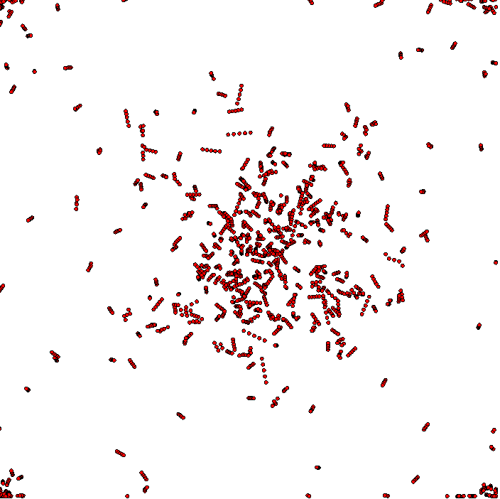

# Points simulation

Simple simulation developed during London clojure dojo. There is 1 basic rule: each point has 2 parents and tries to get to the center between parents. And we added few other rules to make simulation more "alive":

* each point has it's own speed (may be negative - it means that point is repelled from it parents);
* with 10% chance each point can randomly change it parents;
* each point has constant velocity - vector, that defines how point would move if it had no parents;

## How to run

Just run `src/quil_simulation/core.clj` file. 

## Screenshots
Basic version:  

Showing trail for each point:  

